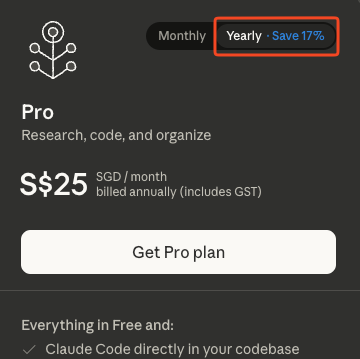
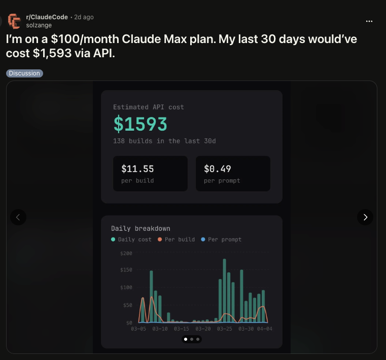
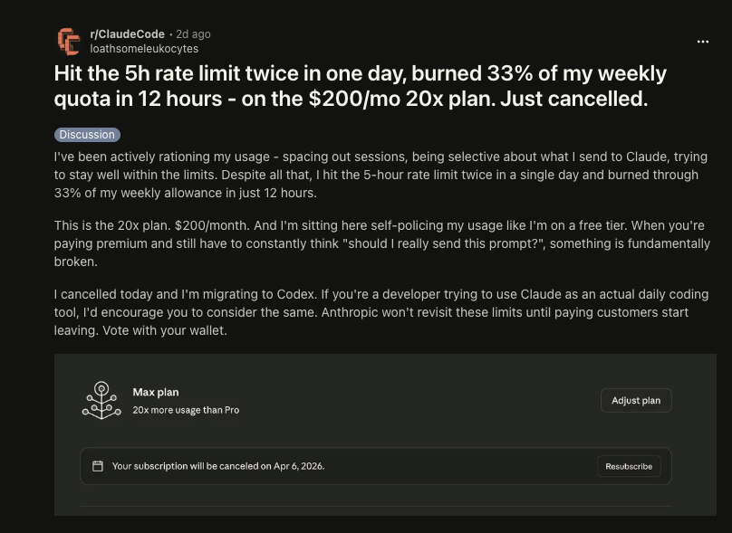
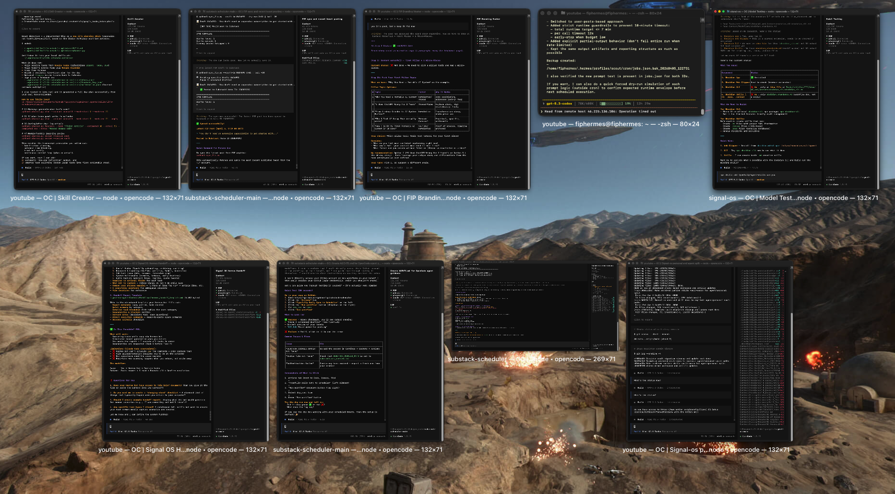

# The top 1% of AI users show no loyalty to model providers (and neither should you)

If I had to rebuild my AI stack again, I would never buy an annual model plan.

I'm lucky that I didn't get stuck in one. But with the recent Claude policy changes for OpenClaw, many on Reddit and Twitter are trapped.

Anything can happen in 1 year, and you're left frustrated with lower rate limits, limited integrations, or a plan that's completely unusable.

So to avoid getting locked into any provider, I made 2 key rules for my AI system:

- Only buy monthly plans
- Make my system completely portable with different providers

Here's the exact setup I'm using to switch providers without losing output quality:

---
## You're paying more than what you save

Most model providers want to lock you into annual plans. They dangle the perception of saving 20% or 2 months from your plan, which makes it seem like a good deal.

While deciding which AI plan to go with, I was tempted to go with annual plans for these extra cost savings.

But a Reddit comment made me change my thinking completely:

**Once you lock in with them, you're essentially trapped. So go for the monthly plan instead.**

Anything can happen during this 1 year, especially when things change so quickly in this space.

Will Claude or ChatGPT still be the best models in 2027? Maybe, but it's hard to say.

Other providers are getting better each day. Every new model claims they are smaller than Opus, but with almost the same capabilities.

Open-source models are competing with frontier models, and they can significantly reduce your costs (if you already have the right hardware).

While you save money with the annual plan, you're incurring costs in other ways.

Right now, all of our coding plans are cheaper than direct API calls. 

OpenAI did amazing PR by resetting their rate limits twice over the past 2 weeks.

https://x.com/thsottiaux/status/2039248564967424483

Why would they do that when it incurs more costs for them?

We're at the stage of hyper-competition in the AI space, as every model provider rushes to acquire new users:

- Free tiers with generous rate limits
- Heavy discounts on their annual plans
- Attractive pricing for new business seats

https://x.com/thsottiaux/status/2039901964679688437

All of these marketing tricks are aimed at building loyalty, so you stay inside their ecosystem.

But once the cost of acquiring a new customer no longer makes sense, things will change for the worse.

Most of our token usage is subsidised by VCs.

https://x.com/Legendaryy/status/2033525617421906189

*OpenAI just announced its latest funding round of $122 billion, which is just insane.*

It's all the same for tech companies, just like how Uber underpriced their rates to get more users.

https://x.com/Pranit/status/2038831721790271814?s=20

But eventually, the funding will dry up.

The costs of large-scale inference will increase to meet the demand for more users. And VCs aren't a charity, they expect these AI companies that they've so heavily invested in to start turning in profits.

**Once that happens, you get trapped.**

The rate limits decrease rapidly. Typing in one simple request can cause a spike in your usage.

Companies start removing integrations because their infrastructure can't handle the sheer amount of requests.

https://x.com/bcherny/status/2040206440556826908

We're at the tail end of the golden era for AI.

*I have many regrets about not starting earlier before Claude Code blew up, as that would have given me more freedom to play around with AI.*

The free inference, generous rate limits, and any other perks will soon be a thing of the past.

And those who are locked in are the ones who are trapped the most:

---
## You need a Portable AI System

The best model that works for you today, won't be the best one that works for you next month.

And when you're locked in with one model, it's so hard to make the switch a few months later.

That's why I've been so obsessed with building a Portable AI System for my workflows, which needs to meet this criteria:

- I have full control over my data and workflows (it's not locked into one provider)
- I can easily switch between any model (my system can connect to almost any model provider)
- I still get a similar quality of outputs, but at a lower cost

The key characteristic of this system is adaptability. I'm only locked into a plan for 1 month, so I can try it and switch to another one (if it doesn't meet my needs).

My data, my context, and my skills are all fully owned by me. And because I build highly specific workflows (Skills) through iteration, I can get almost any model to execute the same workflow with similar results.

Inside this system, there are 5 key components required for it to run successfully:

- A file system that includes my context and Skills (in the `.agents` or `.claude` folder), all in the `.md` format
- A monthly LLM coding plan or API (this will change frequently)
- A Bring Your Own Key (BYOK) interface that lets the LLM access my files
- An editor platform to do all of my writing 
- A syncing platform so all of my work is accessible across any device

I've been trying multiple setups, and I've finally settled on a Claude Code-Obsidian hybrid system:

- A simple folder on my Mac desktop for my context and Skills
- OpenRouter for free tier models (1,000 requests/day after a $10.50 deposit) and other coding plans as a backup (I'm currently using @Zai_org's GLM)
- @opencode to connect to these models (it's available on both Desktop and Terminal)
- Obsidian for editing
- GitHub for syncing between my desktop and laptop

I've moved on from the OpenCode Desktop app (because it became too laggy with the number of chats that I have).

Right now, I'm using the Terminal because I can run multiple windows at the same time, each for one specific task I want to complete.

*Though it's messier than I would have liked, and I should have sticked to at most 2 windows for my setup.*

You may be wondering, why is there no OpenClaw or Hermes at all?

There's too much noise right now with everyone bragging about the complicated workflows on Twitter, making you feel so inferior.

Instead of focusing on what to run with these agents, build out high-quality workflows first.

Once you get the outputs that you want and like, then it's time to go for 'always-on' automation.

**Not everything you build with AI has to be impressive or make you 7 figures.**

All you need is getting AI to solve one painful problem in your life, and that's enough to change the way you see AI.

---
## Don't get trapped by convenience and take action instead

You don't have to get locked into one ecosystem just because they offer you a seemingly good deal.

Yes, it's so tempting to just stay with a Claude or ChatGPT plan. It feels so convenient and easy. But that only benefits them, and not you.

Anything can happen inside the full year that you lock in.

So instead, you need something portable enough so you can switch out models to whatever you like and still get the same outputs.

If you’re done being locked into one provider, start with this free setup [video guide](https://simple.gideonfip.com/).

But if you want to go one step further and receive personalised guidance to build yours out, I'm launching [Signal Start](https://start.gideonfip.com/) as a 90-minute workshop on April 30. 

We'll go through the setup and build out Skills and workflows that work for you and your specific context.

Register your interest below:

I WANT IN
https://start.gideonfip.com/
