# What no one tells you about OpenRouter's free tier

I've seen so many YouTube videos that claim you can use Claude Code for free with OpenRouter, but they're severely understating the limits of this plan.

I've been a heavy user of this free tier ever since I found out about this 'good deal', and it's starting to get worse with the lower rate limits and greater congestion.

So before you use it, here are some key considerations and caveats about OpenRouter's free models from my experience:

---
## The 'completely free' tier is extremely limited

If you want to use OpenRouter completely free, you'll be severely disappointed with how quickly the requests get used up every day.

The 'truly free' tier is limited to only 50 requests per day (different from token-based usage).

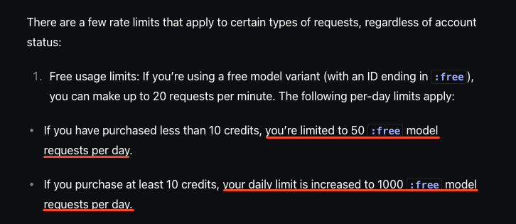

Depending on how complex your request is, it is possible to use multiple requests within the same prompt. 

*So if it's very complex, you could reach this limit quickly.*

To get more free requests per day, I would recommend topping up ≥ $10.50 to your account.

This now gives you 1,000 free requests per day, which is much more generous.

Right now, I'm comfortably below the rate limits every day, where I'll send at most 500 requests a day.

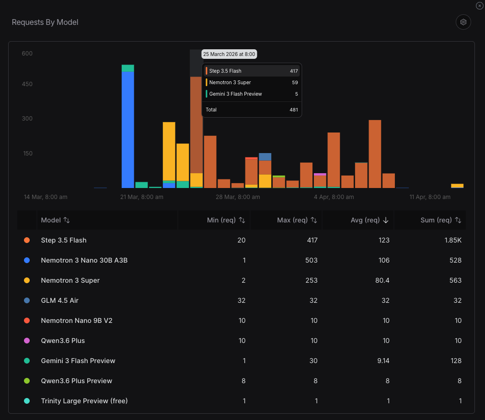

*Though I don't use OpenRouter's free tier for all of my tasks with AI, so it doesn't paint the full picture.*

While 10 credits cost you $10, OpenRouter charges a 5% fee for crypto top-ups (or a $0.80 minimum fee if you top up via a credit card).

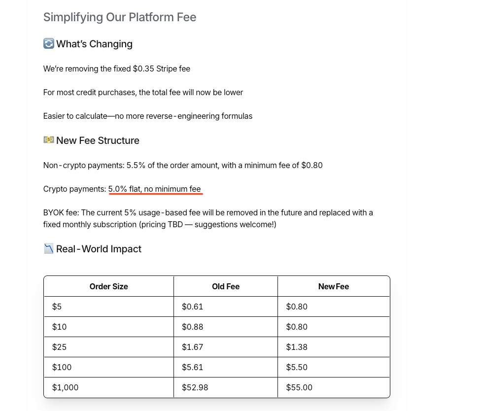

The fees are definitely much more expensive than other model providers, and I'm just focused on making this one-time top-up so I get access to the higher rate limits.

But I've already spent $1.50 with this mistake:

---
## Your credits may get used unknowingly

I added my OpenRouter API key to my Hermes agent, with the main aim of using the free tiers for simple tasks.

But what I found was that my API key was being used for the paid version of Gemini 3 Flash, and I spent $1.50 without intending to.

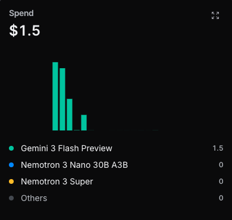

*Though the good news is that you don't need to maintain 10 credits in your account. So long as you have topped up 10 credits, you'll gain access to the 1,000 requests per day.*

If you're just intending to use the free tiers, set a usage limit of 0 and you won't face the same problem as me.

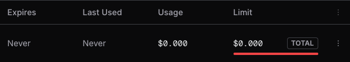

I likely incurred paid model usage on OpenRouter because of this:

---
## You get rate-limited when servers are overloaded

Hermes may have fallbacks when the free tiers are overloaded, and that's why Gemini 3 Flash was used instead.

Since we're on the free tier, our requests will be the lowest priority.

There will be certain timings when the demand for compute is extremely high, and our requests will take much longer to be completed.

You'll likely face rate limit errors like these.

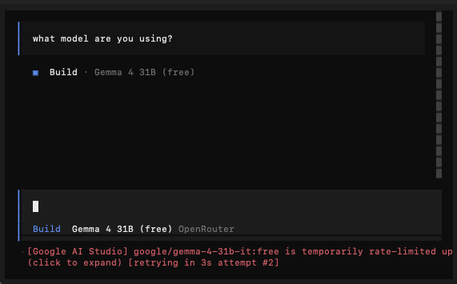

Sometimes, when the model performs multiple steps before giving an output, you could be rate-limited during the entire process.

So I'm only using this free tier to execute tasks that I don't require the result to be instant.

*The tasks that require more thinking will be outsourced to my paid subscriptions instead.*

Some of the models won't be rate-limited as much, but that comes at a price:

---
## Your data can (and will) be used for training

At the time of writing, NVIDIA's Nemotron 3 Super is the most popular free model on OpenRouter.

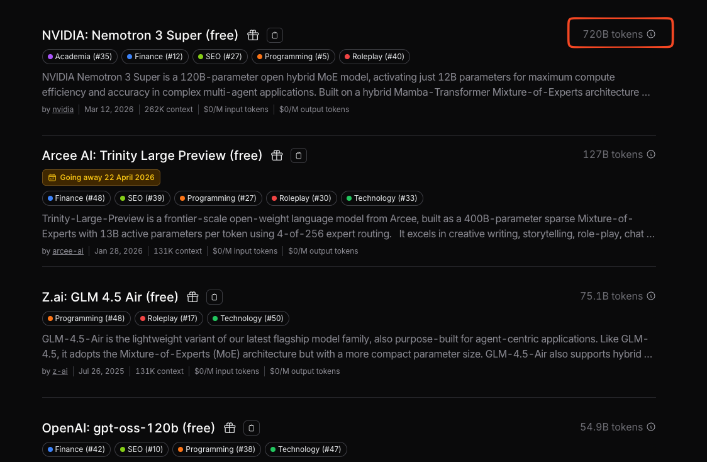

I've used it before and it's rather stable, but it comes with a catch:

NVIDIA will use whatever data you send to the free version to train its models.

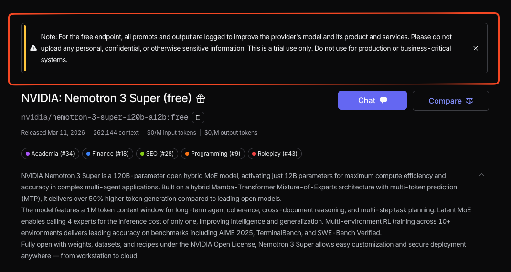

If you're conscious about privacy, this is a key consideration before you select the Nemotron family of models.

Other free models do not have the same disclaimer, but it's possible that they may use your data too (there's no such thing as a free lunch).

I'm fine with this disclaimer since I'd outsource more of the monotonous tasks to Nemotron instead of ones that heavily involve my personal data.

---
## Models will change frequently

I wouldn't get too reliant or comfortable with any of the free models.

Without warning, they could remove any model from the free tier, just like what they did for Qwen 3.6 Plus.

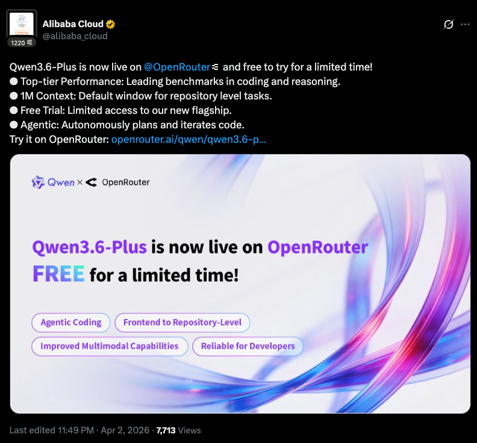

When a new model launches, they'll give it away for free on OpenRouter as a marketing stunt. For Qwen 3.6, it was only available for a week.

I was a heavy user of the Step 3.5 Flash free tier, because it was fast and could execute most tasks.

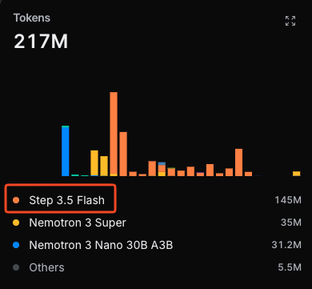

But a few days ago, it was removed from the free tier with no announcements at all.

There will be some, like Arcee, that disclose when they'll be removed, but I wouldn't count on it.

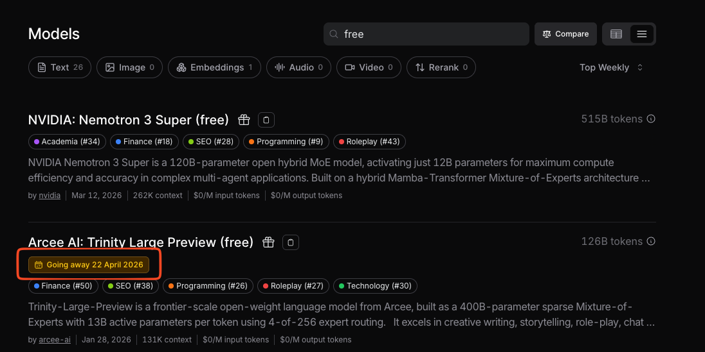

After the Step incident, I'm showing less loyalty to any models on the free tier. They will come and go, and I'll just enjoy the free inference while it lasts.

---
## It's getting worse, but OpenRouter is still worth $10.50 (for now)

Since I started using the OpenRouter free tier a month ago, the quality has dropped significantly:

- Fewer free models to choose from
- Servers are getting overloaded constantly

I see the OpenRouter free tier as a backup plan, and not my main model provider.

The free inference is great, but it won't last forever. Sooner or later, OpenRouter will nerf this tier further once the costs of giving away free tiers are no longer profitable.

So I'm only using it for executing tasks where I don't need the outputs immediately and don't require thinking capabilities.

*Tasks like updating my calendar or fetching my latest Twitter posts from Typefully.*

That way, I'm able to save those inference costs on my main subscription plans (I'm currently using ZAI and OpenCode Go), so I don't hit the rate limits that quickly.

As a one-time payment of $10.50, I still think it's worth it for now, so long as you build up good skills that give clear instructions to the LLM on:

- What the desired outcome is
- What are the steps required to reach that desired outcome

To learn how to set up OpenRouter's free tier with your AI system (via an API key), the full steps can be found in my [YouTube guide](https://youtu.be/zJcw-U-G5AE).

That's why I'm focused on building a [Portable AI System](https://signal.gideonfip.com/p/the-top-1-of-ai-users-show-no-loyalty) where I can switch models at any time, and still get the same quality of outputs.

So if you want to stop getting locked in with one model subscription and build a system that is model-proof, join my live workshop on 30 April.

I'll guide you live to build an AI system that works for you, instead of copying another influencer's template.

I WANT IN
