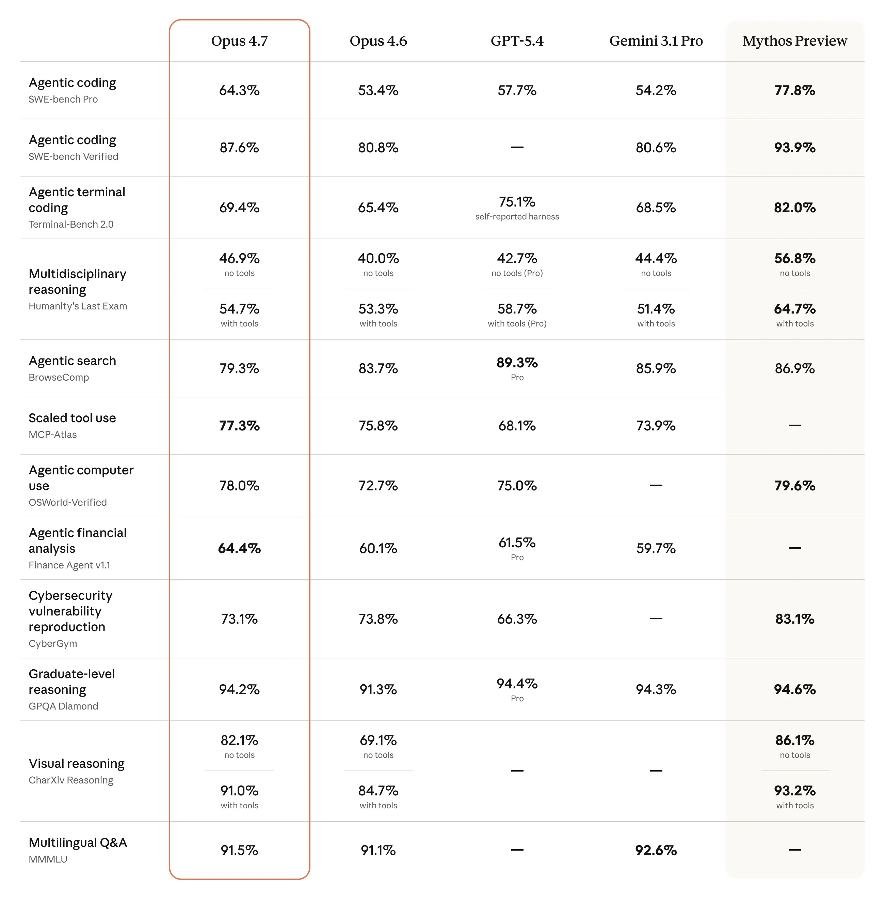
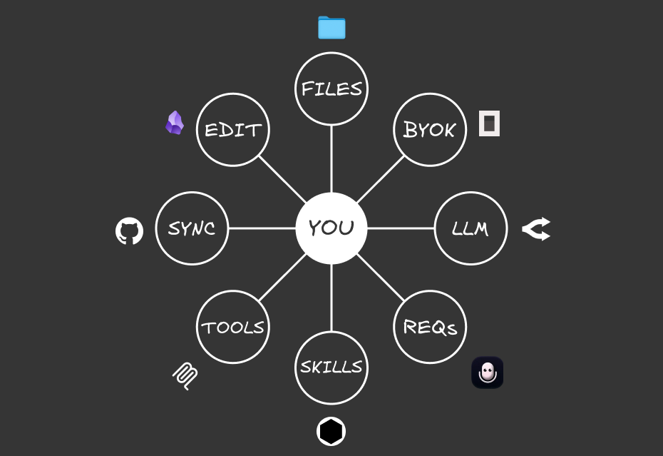
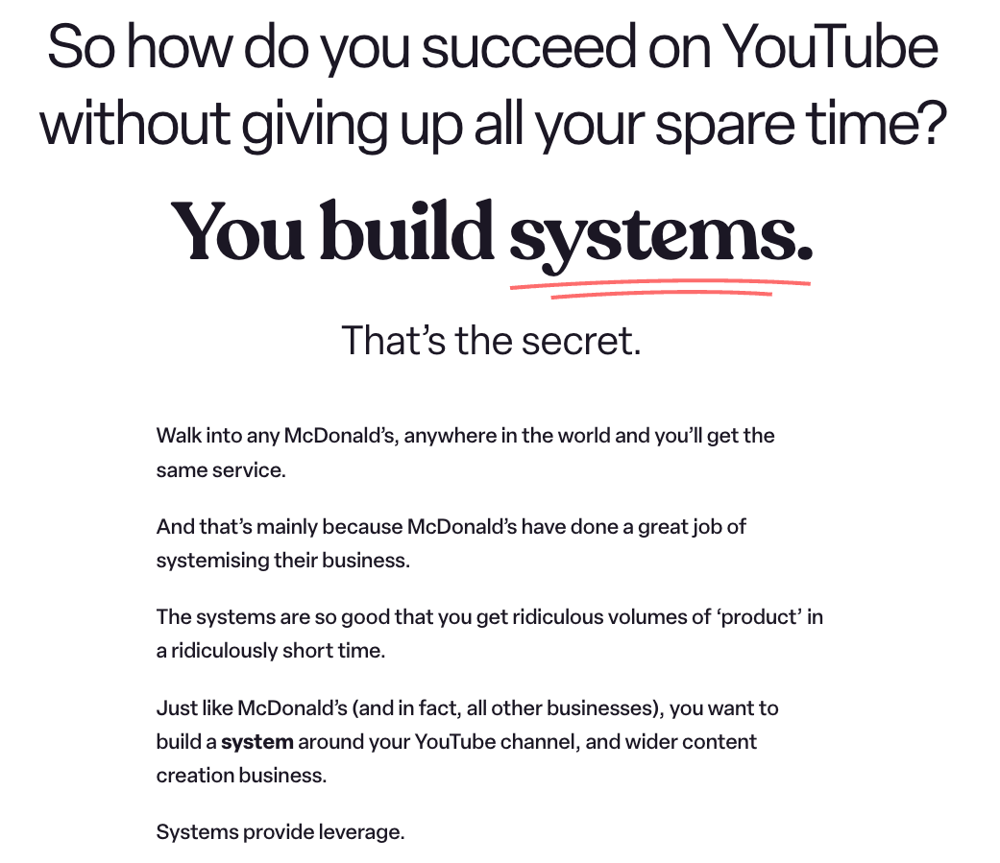
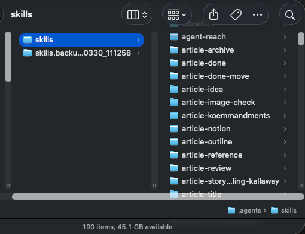
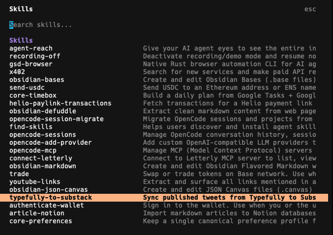
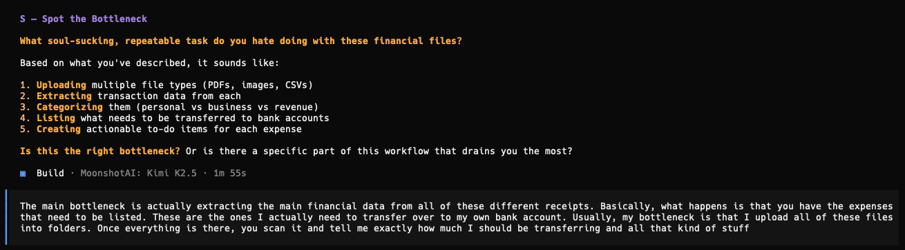
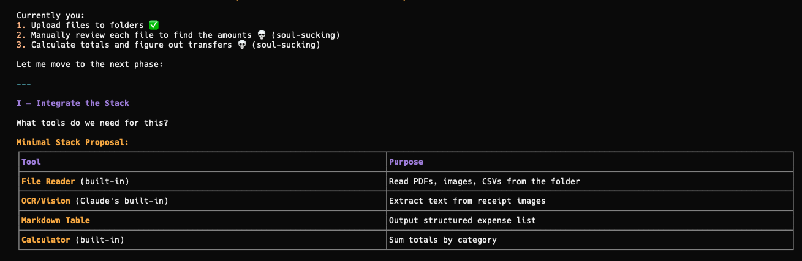
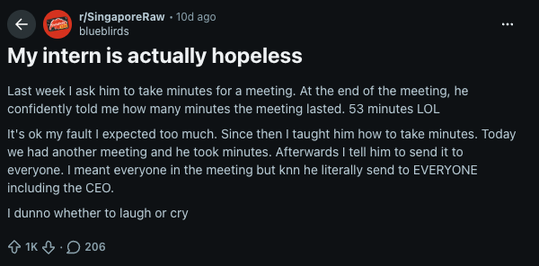
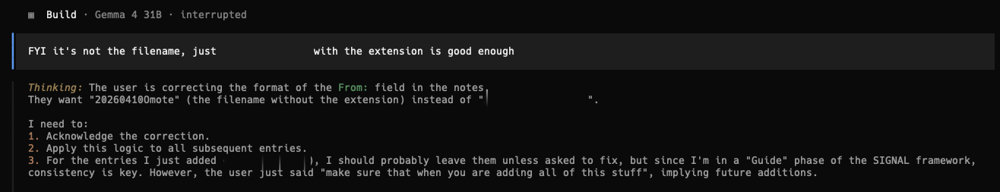
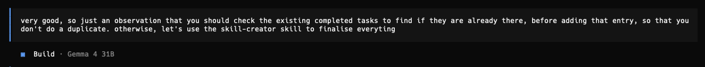

# You're stuck in the AI cost war (this is the only way to escape)

Rate limits have become the greatest enemy of any AI user. Model providers are no longer as generous as before, and we are at the losing end.

The AI cost war is just getting started, and inference will no longer be as cheap as it currently is right now.

I'm facing this constant struggle of managing my usage very carefully to avoid being rate-limited, and it has been a pain (and somewhat stressful experience).

Those who constantly hit rate limits will be those who are in a constant loop of asking AI a question and it executes, which burns too many tokens.

Meanwhile, the ones who survive are those who know how to spend their tokens wisely. Instead of prompting simply every time, they build out repeatable workflows that have clear instructions for any model to execute.

With models now being a commodity (so many are good now), the only key differentiating factor becomes the workflow and instructions that you give AI to execute.

And today, I'll be showing you that key component you need in your system to escape this cost war:

---

## Models will only get more expensive from here

Vibe coding used to be fun. AI used to be accessible to anyone who subscribed to a Coding Plan.

We saw posts about how someone can vibe code a cool tool that helps them with their workflows, and I remembered no one complaining about the rate limits.

A few months back, I knew nothing about this term. I never worried about them because it seemed like I would never hit them with my paid subscriptions.

I just kept prompting simple requests and asking AI to make simple changes to my vibe-coded projects (which was the completely wrong way to do it).

But it's not the same now. If I were to do the same actions, I'd likely hit my rate limits with just a few requests (when I could have made the edits directly via a code editor).

Models used to be cheap because model providers wanted to acquire more users. They cut costs and give usage limit promotions to lock you in with their annual plans. Most are not profitable, and that has to change.

Right now, most of our costs are still being subsidised by the VCs. But it's only a matter of time before model providers are forced to make profits (they'd want a return on their investment).

And that's when AI will no longer be for everyone. We start to face the real costs we incur when using AI, which are exponentially higher than the costs we have right now.

A simple chat with the AI will use 20% of your weekly limit. Soon, AI will only be accessible to those who can afford the higher-tier subscriptions.

*While everyone else is left with the scraps of poor rate limits or low-tier models.*

Rate limits get hit more easily, and providers decide to cancel third-party/agent integrations when it becomes too expensive to run them with a coding plan.

The $10/month Coding Plans will be pitiful, and we barely get any usage out of them. Or, they could just be like Z.AI and [increase their subscription plan costs](https://youtu.be/f4NLu0ylrYY) without informing anyone.

And those who use AI as a simple chatbot without building anything repeatable will be stuck in this cost war.

---

## Most people are too focused on the models

Every now and then, a new model will launch with all the hype and engagement farming on the timeline, just like [Opus 4.7](https://youtu.be/iDx_LWPoAt8).

Most talked about the benchmarks that they exceeded every other model. 

But does that matter to you?

The 'best' model may not always perform the task in the way that you like or expect. In other cases, a 'lower-tier' model could give you the same output at a lower cost.

The 'best' model today won't be the same tomorrow, since everything changes so quickly in AI.

Maybe it's because I'm using AI differently from what others are used to.

I've stopped vibe-coding extensively, unless there's something that I'd believe is truly useful to myself (like [FreeTierModels](https://freetiermodels.com)).

Instead, I'm using AI to automate tasks that I hate doing myself. The soul-sucking, repetitive actions that I do every day can be offloaded to AI.

So instead of stressing over what model you should use, I'm focusing on building this instead:

---

## You need to build a Portable AI System

I've been obsessed with building a system that lets me easily switch between any model or subscription, while still getting good outputs.

Everything needs to be modular and flexible enough so all of my data remains truly mine, while the model is just the executor that automates the workflow for you.

These are the 8 PORTABLE components of my system:

- Personalised context: A file system that includes your context and tasks so any model knows who you are, what you do, and how you think
- Owning your keys: A BYOK provider that lets you easily switch between models, even within the same chat window
- Requests: Your input (voice or text) that gives commands so the AI runs tasks for you
- Thought processor: The LLM acts as the brain that receives an input and provides an output
- Actionable workflows: Skills that are repeatable and can be invoked by any LLM
- Building capabilities: Tools like MCPs or APIs that increase the capabilities of your system to external platforms
- Link across devices: Syncing across multiple devices
- Edit and manage: Using a markdown editor to write anything in your system

Any of the external components (like the models) can be switched out and the system still works. 

We are not locked in with one provider, while still having access to all of our data (instead of having to export it).

And the only way for the entire system to work with any model is through repeatable workflows:

---

## Skills let you Build Once, Switch Anytime

Systems thinking is something that I didn't care much about. But the more I looked at how any business runs, everything has an SOP.

Someone like McDonald's, which I quote this idea that Ali Abdaal makes in his videos:

> McDonald's has built systems so easy and repeatable that they can replicate across any outlet.

Any employee can be hired, and they can immediately start contributing to the system because of the clear workflows and SOPs that have been built.

And it's not just McDonald's, any food outlet is the same:

- Someone takes orders
- Orders are passed to the kitchen
- The kitchen prepares the food and passes to the server
- The server gives the food to the customer

Everyone has well-defined roles and workflows with clear instructions on how to execute the tasks they are expected to.

**We can build our AI system in the same way.**

Our employees (models) can be switched at any time, while we get the same output because we gave them clear instructions on how to execute the task, regardless of the model we choose.

If you'd heard of Claude Skills before, these are repeatable SOPs written in .md files that tell Claude how to execute anything to get an output that you want.

In my current AI system, I've added 190 different Agent Skills (it's not just limited to Claude) to automate all of the tasks in my daily life.

Some are ones that I built, others I've downloaded or adapted from skill repositories online, and these let me carry out certain actions like:

- Converting my long-form article into an HTML file that can be easily repurposed into Substack, Medium, and LinkedIn
- Fetching an onchain summary from DeBank from the wallets that I track
- Syncing between my lead magnets and email platform
- Generating colour palettes for different sites and my own brand
- Adding YouTube transcripts and summaries into my knowledge base
- Converting different files into markdown for easy reading by AI
- Full workflows that keep track of all of my articles and YouTube video scripts

These are just some of my examples, but there are many others that you can add to your own workflows.

But I'm not going to bore you with the technicalities of how a Skill works. What's more important is using the right steps to build out a Skill that you can use with any model:

---

## The framework to build effective Skills

You may be wondering, why even bother with learning how to build Skills?

There are so many repositories out there with Skills for almost any use case.

But what works for someone else may not necessarily work for you, because everyone's workflows will be different.

*And there's a risk of prompt injection attacks when installing someone else's public Skill, so I'd adapt my workflow from them but never copy it directly.*

You have a unique way of carrying out a certain task to get to an output, so there's no point in copying someone else's workflow.

While it seems daunting to write out a SKILL.md file, it's not that hard. You just need to run the entire workflow together with AI, and work on solving the problem together.

There's no need to write out the entire SOP (which I hate doing). Once you get a 'gold standard' run that gets the output that you want, the LLM will write out the full spec while taking note of what they should avoid (through bad runs).

*So there's no coding involved either.*

I've developed a SIGNAL framework that I use whenever building a new Skill, and here's how you can use it too:

(I'll be using examples from a recent Skill that I built with this framework):

---

- **Spot the bottleneck**

Instead of building out your entire system from day one, let's start small and find one annoying problem to solve first.

Throughout your entire life, there are many tasks that are extremely repetitive and soul-sucking, and you just wish there were a way to complete them much faster. 

This is exactly how AI can help you automate your workflow: you only need to give AI a command, and it executes the entire workflow for you.

First, spend some time trying to identify that annoying problem you have. What is something you wish you didn't need to do every single day?

It doesn't matter how small it is, it just needs to be something that you hate doing.

*That gives you more motivation to find a way to solve that bottleneck.*

It can be as simple as connecting a new provider to OpenCode. I didn't want to constantly: 

- Go back to their documentation 
- Find the right page and give it to the AI to execute it

So I built out a Skill to lay out exactly how I want this action to be done (just like all of my [other OpenCode skills](https://github.com/gideonfip/opencode-skills)).

**If it's something that you do repeatedly, it can be converted into a Skill.**

*And this saves so much time because you can just invoke it with a slash command.*

Frame your problem by describing exactly what you want to achieve, and what bottleneck you face.

The more details you give the AI, the better it can understand your problem and suggest a solution.

*I'd suggest using a voice transcription tool (I'm using [Letterly](https://letterly.app/?ref=nuhgid)) to describe your problem via speaking instead of typing.*

Here's a recent example of mine when building out a Skill:

---

- Integrate the stack

After telling AI what the problem is, and if you give enough details to it, the AI should come up with a comprehensive plan on how to automate that workflow for you.

Some skills don't require complex tools. They can just exist as a simple SKILL.md file with written text on what to execute.

Others will require connecting to APIs or MCPs (if you're using external platforms), or Python scripts to execute tasks (like getting all of the recent tweets I posted via Typefully).

Depending on what platform you use, the LLM will recommend a way to connect with them so you can carry out the task.



*That's why Skills are more versatile than prompts that just give you text-based outputs.*

---

- Guide the LLM

I saw a recent Reddit post that complained about how confused an intern was when executing tasks that the OP instructed him to do.

A similar concept can be applied to AI:

They are just an execution tool, and if you don't define your instructions clearly: 

They'll come up with extremely poor outputs.

*Ones that you don't expect because you didn't guide them enough.*

So we have to walk through the entire workflow with AI step by step. We can't expect it to know what we want, especially if we don't articulate it clearly enough.

That's why after framing the problem, I'd always want to run the entire workflow once to see how the AI understands and executes the task.

It will never be perfect during the first pass, and the only way to build the Skill is through failing repeatedly:

---

- Nail the standard

I can guarantee that the AI will make mistakes when running through the workflow.

I've experienced it so many times, but it's actually good that they make the errors now.

By telling it what went wrong and what it shouldn't do, it has more context on the wrong executions and what to avoid.

That's why I like failures at the start:

We get to iterate on the workflow together with AI and get it to clarify anything that they're still unsure (which could be something we didn't think of too).

Constant iteration is the only way to build a good Skill. It's tedious, but once you get the 'gold standard' that gives you the output you want:

It's finally time to turn it into a Skill.

---

- Automate the logic

This is probably the easiest step, after getting the output that you want.

Claude has a skill-creator Skill that outlines exactly how a Skill should be created and how to reduce the token burn through progressive disclosure.

**There's no need to understand how it all works.**

Once you get a successful run, tell the AI to convert the entire session into a Skill, including all of the mistakes made and bad runs with the skill-creator Skill.

While this Skill is focused on creating Skills inside the .claude folder, it's also applicable to any Agent Skill. All of my Skills are in the .agents folder to be invokable by OpenCode, and they were all created by the same skill-creator Skill.

It has rich context on what worked and what didn't, so the Skill becomes more personalised and specific with a higher success rate.

I'd also be more conscious about naming my Skills. When I want to search for them inside my .agents folder, it's easier to find them if I organise by their domains, including:

 - `core-*`
- `learnings-*`
- `article-*` 

*This is entirely optional, and you can choose to name your skills however you like.*

But that's not the end of the entire Skill creation process:

---

- Loop recursively

Whenever we run a Skill, there's likely a new problem or output expectation that we have.

*Sometimes it could be as simple as changing the file directory.*

Skills are not static, and they will constantly evolve.

So whenever there's something wrong or new when you execute them, just ask the AI to update the Skill to fit the new workflow.

Consistently iterate on the Skill until it gets the outputs that you want.

---

## Exit the AI cost war with Skills

Skills let you be truly portable with your AI system:

They are clear SOPs and instructions given to any model that can execute them and get similar results.

And you won't get locked in with any provider because you built the Skill once that can be repeated at any time with any model.

Of course, that's not always the case, especially when asking the LLM to write good content (that doesn't sound like AI slop).

The more expensive models may produce better outputs, but for other workflows that have been converted into reusable scripts, AI is just there to execute them.

So it's possible to use a cheap model like GLM 4.7-Flash, and you'd still get the same results.

To start building out your own Skills, I've included both my SIGNAL Skill framework and the skill-creator Skill inside this folder.

If you want more guidance on building out your own Portable AI System, Signal Starter is a live session where I'll be going through the entire process step by step.

In 90 minutes, you'll:

1. Identify one painful workflow you actually want to automate (not what someone else tells you to)
2. Build the Portable AI System from scratch with the 8 components
3. Turn that task into a working Skill you can invoke anytime

No coding experience is required, and I'll show you how to build your system your way and automate all the tasks that you hate doing.

The session will be live on 30 April and includes the full recording if you can't make it:

I WANT IN

---

## Build Your First Skill in 90 Minutes

I've taken everything in this article — the 8 components, the SIGNAL framework, and my approach to building Skills — and turned it into a live session.

**It's called Signal Starter.**

In 90 minutes, you'll:

1. **Identify one painful workflow** you actually want to automate (not what someone else tells you to)
2. **Build the Portable AI System** from scratch with the 8 components
3. **Turn that task into a working Skill** you can invoke anytime

No coding experience needed. No expensive subscriptions required. You just need to be willing to build.

**The session runs live** and includes the full recording if you can't make it.

---

### Ready to stop prompting and start building?

→ **[Join the next Signal Starter session](https://start.gideonfip.com)**

Session is $49. If you don't walk away with a working Skill, I'll roll you over to the next session at zero cost.

---

*Questions? DM me on X — @gideonfip*
