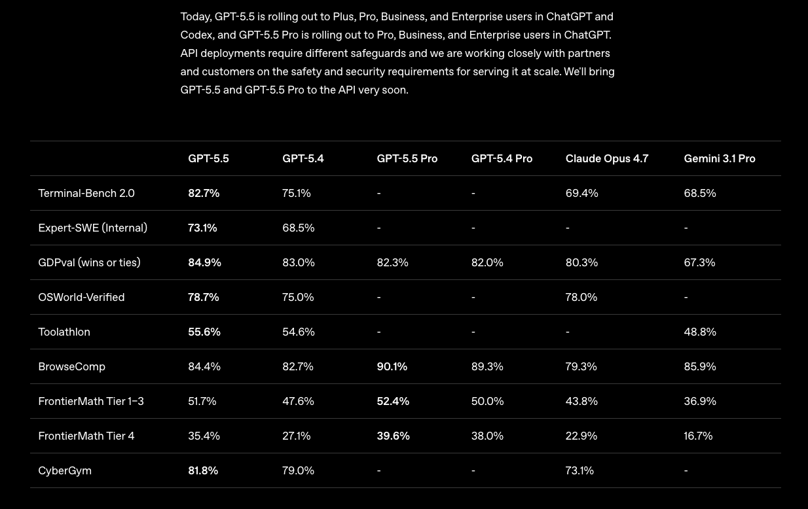
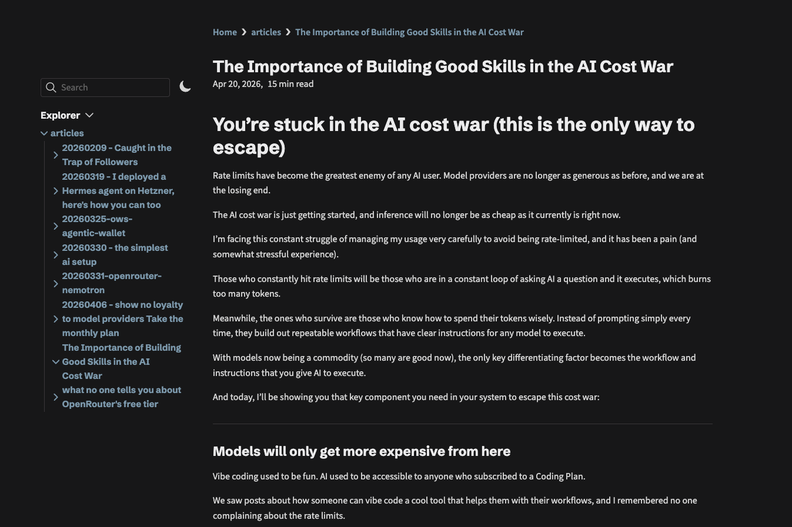
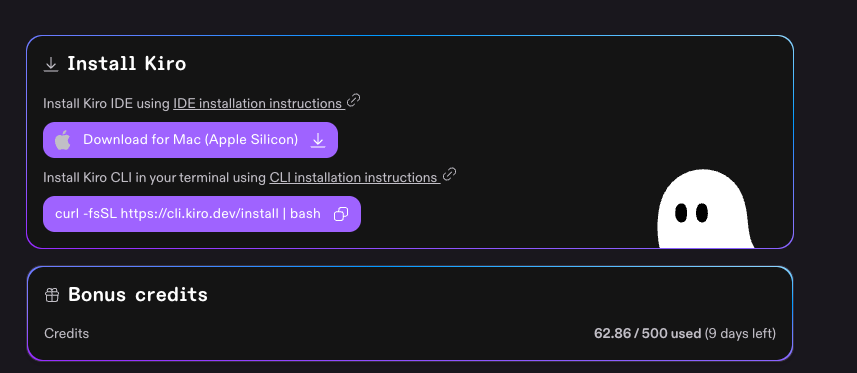

# You're building the wrong AI system (how to prevent yours from breaking)

The AI cost war made me seriously rethink how I approached building out my AI system.

Models are more expensive now, rate limits are getting worse on coding plans, and us consumers are all trapped in subscriptions that no longer serve our purpose.

For those who don't have any additional laptops or GPUs lying around (like me) and don't want to buy new hardware just to run local models, the options of using AI are getting increasingly limited.

Within these few weeks, we've seen instances like:

- GitHub Copilot pausing signups for their Pro plan (just when I wanted to try it out)
- [Claude silently removing Claude Code from the Pro plan and putting it back (likely after the backlash)](https://youtu.be/yaMPjBDehpc)

This is only the start, and other model providers and aggregators will follow the same route of nerfing their plans: 

Because it no longer makes any sense for them to give out inference that costs more than what consumers are paying in their plans.

My first experience with AI was through Claude Code and I grew to [love the Claude Code extension](https://youtu.be/ksVxMTC5Pzs) inside VS Code because of the great UI.

But when I wanted to switch from Claude and try out other models inside my system, it was complicated and I spent too much time troubleshooting it.

It's likely easy for someone who understands code and the config.json files, but I didn't want to continuously find different configs each time when I switched plans.

And that's when I finally realised something about the state of models today:

---
## Models are just commodities

Whenever a new model launches like [Opus 4.7](https://youtu.be/iDx_LWPoAt8) or GPT-5.5, the whole timeline goes crazy.

There are many claims of 'it's so over' all over the timeline because the new model is more capable and will replace jobs in many industries.

The posts go on to show the new benchmarks of the latest model updates and how it surpasses other existing models.

Everyone on Twitter tells you to upgrade to the latest models to get the latest benefits.

Most of it is usually engagement bait. But because of all the over-sensationalised news and fear-mongering, you're convinced that the latest models are the only way to get work done with AI.

You drop everything and sign up for the latest Claude or ChatGPT plan, having to start again from scratch because the model knows nothing about you.

You waste time re-explaining everything to the model, because importing everything from your previous system is too time-consuming.

And all that time is wasted when you could be producing real outputs that go towards achieving your goals.

So now comes the most important question:

**Do you really need the latest model to suddenly become good with AI?**

If your work involves building and running applications that are used by millions, probably.

But for non-coders like myself, we don't need the best model to execute tasks. The ones that can give us the output that we want and at a lower cost is more ideal.

As compared to running a more expensive model that gives us a slightly better output.

But maybe it's because I'm using AI differently from others. Instead of consistently vibe coding (I did build a few projects but it's not my priority), I'm using AI to automate all the tasks that I hate doing.

The soul-sucking, repetitive tasks that do not require a lot of thinking, but I still have to do them for my life to function.

And that's where I see AI is most effective at:

I can outsource these tasks that I hate doing to AI, while I have more cognitive load to worry about the tasks that I enjoy (or those that require thinking).

Functionality beats aesthetic, and all that matters is getting a result.

One example I use AI now is to generate HTML content for my articles, so I can repurpose them in 1 copy-paste function.

In the past, I had a nightmare when I wanted to repost my article across Substack, Twitter, Medium, and any other long-form platform, mainly because of the images.

Copying directly from Notion or Obsidian didn't work. My old workflow involved manually copying and pasting every single image into each section within the article.

And it was a mindless, tedious chore to do this same task over and over again across all of these platforms.

But now with the help of AI, I generate an HTML file that I can easily copy and paste directly into any long-form platform.

*Though I still have to do it manually for Twitter, but it saved so much of my cognitive load.*

This is just one example of how AI has become an executor of the tasks that I hate doing.

And back to the point, it doesn't matter what model you're using.

Most models are capable enough to execute daily tasks that we hate doing. Just tell AI the problem that you're facing, the platforms you use to get the task done, and it will figure out how to do it.

At the end of the day, models are just commodities.

**You can easily switch between any of them and still get similar results.**

Of course, the frontier models will give you better results. But sometimes, a lower-quality output at a cheaper cost is good enough.

And I wanted to build an AI system that gives me that portability to switch between providers at any time:

---
## Most of your AI system is easily interchangeable

When I first tried Obsidian many years back, I thought it was extremely bare bones with a steep learning curve (and decided to use Notion instead).

But when I tried Obsidian again to build out my AI system, I finally learnt how to appreciate its open system.

For my existing Notion system, I had to use an API or MCP for the LLM to understand and work with it, which was more tedious.

Meanwhile, Obsidian was just a collection of folders and markdown files that the LLM can easily read (.md files are LLM-friendly) and edit at any time.

While all my notes truly belong to me, instead of being held 'hostage' by another software company.

This goes along well with @kepano's whole principle of [self-guaranteeing promises](https://stephango.com/self-guarantee):

**One that is verifiable, non-reversible, and does not require you to trust anyone.**

https://x.com/kepano/status/1863985234426888397

Anything within your current system can break, or better options will pop up.

**Is your system adaptable enough to switch any of these components and still function?**

Ever since I wanted to move away from Claude Code, I've been obsessed with building such a system, which I now call the Portable AI System.

Inside, I have **8 core components** that are required for my system to function:

- **P**ersonalised Context: A file system that includes your context and tasks so any model knows who you are, what you do, and how you think
- **O**wning Your Keys: A BYOK provider that lets you easily switch between models
- **R**equests: Your input (voice or text) that gives commands so the AI runs tasks for you
- **T**hought Processor: The LLM acts as the brain that receives an input and provides an output
- **A**ctionable Workflows: Skills that are repeatable and can be invoked by any LLM
- **B**uilding Capabilities: Tools like MCPs or APIs that increase the capabilities of your system to external platforms
- **L**inking Across Devices: Syncing your portable system across multiple devices
- **E**diting & Managing: Using a markdown editor to write and manage anything in your system

Most of my system is interchangeable:

- Models will come and go, and I can switch to the most cost-effective one that gives me the outputs I want
- There are many BYOK providers that let me add my own API keys to use their platform (just that I like OpenCode for now)
- I can use any tool for voice requests (just that I bought a lifetime licence for Letterly)
- There are plenty of markdown editors (but Obsidian is still king)
- APIs and MCPs can be switched whenever I use a new platform
- GitHub is the best for syncing and version history, but a new platform may pop up at any time

At any time, I can switch any of these 6 components to something newer or better. And the system still continues to function while giving me the outputs that I want.

Though there are only 2 components that truly belong to me (and that's how I won't be replaced by AI):

---
## Nothing else is more valuable than your context and skills

The best outputs from a model come when it has these 2 things from you:

- Your context (a file system that helps the LLM understand who you are, what you do, and how you think)
- Your Skills (repeatable workflows that you've built out for the AI to execute for you with clear instructions on your specifications)

If you ask AI to 'write a viral tweet', the output will be average because it knows nothing about the type of content you write, or the templates that you want it to follow.

But if you have a library of your past tweets that display your tone and your main ideas, and you have some tweet templates (or a prompt) that you want to follow: 

It will give a tailored output that fits your needs, instead of something that is so generic.

And that's something that becomes the most valuable asset of your entire system:

- Your thoughts, perspectives, and the type of content you consume
- The specific workflows that you use to get an output that you want

Everyone has their own way or workflow of doing the same thing, like writing an article or managing their to-do calendar. The steps we take to complete the same task will be different and cannot be copied.

And if you can articulate that workflow clearly to AI (via creating a Skill), it can execute it in exactly the way you want.

*Which is why I don't recommend downloading and using someone else's skill, and I prefer adapting those skills to fit my own context.*

The models you use are the commodity, while your context and Skills are the true assets that are irreplaceable and are the core for your system to continue functioning.

Any of the 6 components can be swapped out from the system, but context and Skills are eternal.

---
## You need to have zero dependencies in your system

Most YouTube videos out there share all the amazing things with Claude Code.

But you can execute the exact same tasks in a system that doesn't require you to just be locked in with Claude or any other ecosystem.

There are many models that will offer promotions or free trials, just like what OpenAI did for me.

https://x.com/gideonfip/status/2047882032685215794

Or you could get sign-up bonuses like Kiro with 500 free credits that you can use.

And because my system is flexible enough, I can switch between any IDE or model and still get the outputs I want (because everything is written inside of my Skills).

*Especially when a model or coding plan gets progressively worse or more expensive.*

The AI cost war will only get worse, and the only way to escape is by building a Portable AI System:

**One that lets you automate the tasks you hate with a system you truly own.**

So focus on building out your context and your Skills, while worrying less about what models you are using.

The answer to 'what is the best model' is 'all of them'. Give them the right context and workflows, and they'll execute tasks in the exact way you want them to be done.

Learn more about how to build out good Skills [here](https://signal.gideonfip.com/p/youre-stuck-in-the-ai-cost-war-this).

