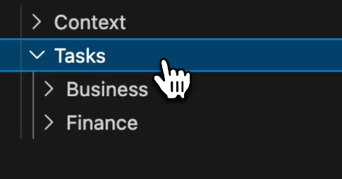
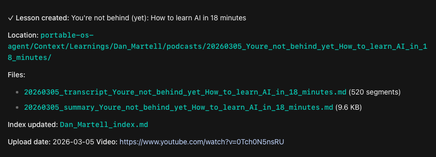

# How to become AI fluent when you're a time-starved working adult with zero coding experience

Everyone's telling you to use AI or you'll get left behind, but you have no idea how to start. 

Time is so tight, and it's impossible for you to try everything that gets shilled on Twitter or YouTube.

As a non-coder, you think that you're at a disadvantage because that's the only way to become AI fluent. 

**But that's completely wrong.**

You don't have to spend time learning code to become good at AI. Of course, it's more beneficial for you to know it, but anyone can build anything with AI now.

**If you know how to describe your problem in plain English, AI can create a solution for it and execute it for you.**

While I've been unemployed over the past month, I've been using AI extensively to get better at it.

So I've gone through all the failures, getting frustrated when things don't work, and spent all the time finding out what works for non-coder like myself to become AI fluent.

And here's the framework I wish I knew before I started:

---
## What AI is, and isn't

Before we start, let's get this point out of the way.

AI is not a magic pill that can drop 6 figures in your lap with just one simple prompt.

*If that were the case, everyone would be millionaires already.*

But after using AI extensively since January, this is what I realised about AI:

**It is an amplifier of systems by automating the soul-sucking, repetitive tasks.**

But if you don't have a system or clear workflows, it will amplify that as well. And the result comes out as an amplification of a messy system that you'll spend more time troubleshooting the system than getting real outputs you could use in your life or job.

*Trust me, I've wasted weeks of my life just getting OpenClaw and Hermes to work, while accomplishing nothing.*

**There's no point in building agents that automate every task for you, when you don't even know your workflow well enough.**

It's impossible to hand off everything to AI completely. You still need to give inputs on what works and what doesn't, based on your own taste and judgment, while AI is just the execution engine.

Quoting from [Albert Romero](https://www.thealgorithmicbridge.com/p/you-spent-your-whole-life-getting), who introduced me to this concept:

AI collapsed the how, so the only thing that matters is determining on the what.

So to get good at AI, you need to get good at determining what to use AI for (because it's great at some things, but not at others).

And this is how you can do it:

---
## The FOCUS Method to get good at AI

With all the shiny new tools that are constantly being shilled on Twitter and YouTube, you're likely overwhelmed.

And with every new feature that Claude or ChatGPT launches, you're tempted to throw whatever that you've built away to start using this new feature.

**But to become AI fluent, you just need focus.**

Focus on the fundamentals, understand what AI can do for your workflows, and then try the tools afterwards once you have a better understanding.

With time as your most precious resource, we need to optimise it so you don't waste it on actions that won't help you become AI fluent.

This is the FOCUS Method that I use to learn AI:

- F: Filter the noise
- O: Optimise your context
- C: Concentrate on one win
- U: Use it daily
- S: Scale your Skills

And here's each step in detail:

---
## Filter the noise

AI Twitter and YouTube are the perfect places to make you feel completely inadequate.

There are so many proclamations of how everyone is: 

- Running a fully autonomous company with AI
- Replacing a $120k/month department with just Claude Code
- Using 10 agents to get them to 100 million views

But 90% of what you see online is just noise. The ultimate skill to possess right now is skepticism, because nothing can be trusted.

*It's just a waste of time scrolling on the timeline, when you could be building something that solves a painful problem in your own life.*

I found one way to solve this is by DM-ing the account that makes all of these insane claims. How did they actually do it?

**If they can't answer you clearly, then it's likely just farming engagement.**

It's impossible for someone to become an expert at a new feature just 5 hours after it was launched.

So don't fall into the trap of feeling bad about yourself by comparing with accounts that do nothing, yet are acting as they do.

I approach this by taking inspiration from what others post and see how I can add it to [my current AI system](https://portable.gideonfip.com/).

Since the AI knows me enough after already executing multiple tasks for me, it provides a recommendation on whether this new feature is something worth integrating or not.

And it all starts with providing this to AI:

---
## Optimise your context

AI works best when it knows who you are, what you do, and how you think.

And the easiest way to provide this is through your past work (blog posts etc.) or conversations.

Otherwise, it'll just give you generic outputs when you don't provide it with enough direction on what it should focus on.

So throughout your day, start compiling everything that you're willing to share with the AI, so that it understands you better:

- Your tweets, articles, and meeting transcripts
- Your chat history with AI platforms
- Important documents about your personal life or work

The more you share, the more AI knows you better. But of course, there's this fine line of privacy where anyone who gains access to your system knows everything about you.

*So it really depends on how much you're willing to share.*

LLMs love markdown (.md) files as it's LLM-friendly, so I spent my time converting all of my files into this format.

While it was still a painful process, I'm grateful that most of my work was done in Notion, so I could export my pages as markdown files.

For any files (.docx, pptx) that are not already in the markdown format, I like using this MarkItDown library to convert anything into a .md file that I can give to the LLM to understand me better.

This is a one-time task that can be time-consuming at the start, but it saves you the hassle in the future.

Once you have all of your context compiled, you can throw it inside any LLM to analyse and understand everything about you.

**This also means that proper file organisation is crucial inside your AI system.**

For [mine](https://portable.gideonfip.com/), I organise it between Context and Tasks, so everything about me goes into the Context folder that is used by the AI to complete the Tasks that I want to complete.

---
## Concentrate on one win

I have a bad habit of shiny object syndrome, where I have so many workflows that I want to automate with AI. 

Even when one workflow is not fully fleshed out yet, I want to immediately move on to the next one.

**And that could be a problem that you face too.**

It's better to fully flesh out one workflow that consistently gets you the output that you need, instead of building multiple AI-assisted workflows that require you to constantly troubleshoot them.

Something boring that gets the job done is way more valuable than a flashy workflow that you're just building to get views on Twitter.

Everything else about AI doesn't matter, like:

- What model you should use to achieve the task (because most are already capable enough)
- What tools you should be using (some of the ones that exist today won't last in a few years' time)

We don't need to waste time worrying about the most cost-efficient model when we're on a monthly plan and can swap models easily while finding the best one that meets our needs (some are [even free too](https://youtu.be/X9rZIEjFvwE)).

*And this is only possible when you build a [Portable AI System](https://portable.gideonfip.com/) that lets you switch out components (like your models or tools), and it still gets the job done.*

So instead of worrying about any of this, find one bottleneck that's stopping you from doing a task better or faster, and work on using AI to remove that bottleneck.

This involves building Effective Skills, which are hyper-personalised SOPs that give you high-quality outputs, no matter what model you use.

And you don't need to write them out at all, or even know the right script that automates the workflow.

**Just by going through a dry run together with the AI, it has enough context to build the Skill for you.**

*I shared more about the framework I use to build these Skills [here](https://signal.gideonfip.com/p/youre-stuck-in-the-ai-cost-war-this).*

---
## Use it daily

AI is not a tool that you can use once and get good at instantly.

It has to be something that you do every single day, just like practising the piano.

So commit to spending at least one hour a day playing and experimenting with AI.

This doesn't mean you have to build out a vibe-coded platform every day.

Instead, work together with AI on finding bottlenecks in your workflows, and finding ways to integrate AI inside.

One of the first tasks that I automated was generating summaries for YouTube videos.

In the past, this was the workflow that I used:

- Copy the URL from YouTube
- Paste it into a YouTube-to-transcript site
- Copy the transcript
- Paste it into ChatGPT
- Paste my summariser prompt inside ChatGPT
- Generate the summary

This took about 2-3 minutes and a lot of mindless copy-pasting and getting frustrated when I couldn't find the summariser prompt.

So instead, I built a Skill that helps me achieve this:

I type `/learnings-youtube` with the URL, and it captures the transcript and generates the summary as specified by my prompt without me doing anything else.

Everything is saved inside my Portable OS, so the LLM can retrieve it in future when I ask it to.

From 2-3 minutes of work being reduced to less than 30 seconds.

And all of this was done with the help of AI.

I gave it this problem and the workflow that I wanted to achieve (including where the files should be stored), and it came up with the solution itself.

I'm sure that many of your workflows can be automated by offloading all of the boring, soul-sucking tasks that you hate doing to AI.

And it all starts with: 

- shaping your problems together with AI
- Solving them with automated scripts that AI generates for you
- Telling AI what went right and wrong

The more you work with AI, the more you understand its capabilities, and the more work you can outsource to it.

---
## Scale your Skills

After building out a single Skill, it's time to start scaling them. 

You now have the knowledge to:

- Identify the bottleneck in your workflow
- Shaping the problem together with AI
- Directing AI to the ideal output

And this can now be used across every workflow that you hate doing.

But this final step takes practice. You have to keep playing with AI in this manner to get better at building Effective Skills.

---
## Becoming AI fluent doesn't mean getting another certificate

It is hard to learn AI when you're already pressed for time every day.

Your time is precious, so don't waste it on getting another certificate that means nothing.

Instead, what others are looking out for are real workflows that you have automated for yourself or your clients that save them time.

Being AI fluent doesn't have to be anything fancy. So long as you can show a result for someone (especially saving time), your perceived value increases to your employer or future clients (just like what I'm trying to do here).

*But of course, please don't farm engagement like what most are doing on Twitter or YouTube.*

In the end, the only two things that differentiate you from everyone else are your:

- Context: AI will continue giving generic outputs, unless you give it enough context about who you are, what you do, and how you think
- Skills: Repeatable SOPs that any model can follow to automate all the boring, soul-sucking tasks that we hate doing

Anything else can be swapped out if you build your AI system with portability in mind, especially when the AI cost war will make subscription plans worse in the future.

So to automate the tasks that you hate with a system you truly own and is not locked in with any providers:

Get the blueprint to build your Portable AI System [here](https://portable.gideonfip.com/).

I'm trying to understand who currently reads Stack Signal and how I can make it more valuable for you.

If you have two minutes, take the reader survey [here](https://survey.gideonfip.com/), and I'll share what I find in a future issue.

I write about AI every week for non-coders who are overwhelmed by all the noise online. If you want to build workflows that automate the tasks that you hate doing, subscribe below:

/ADD BUTTON
