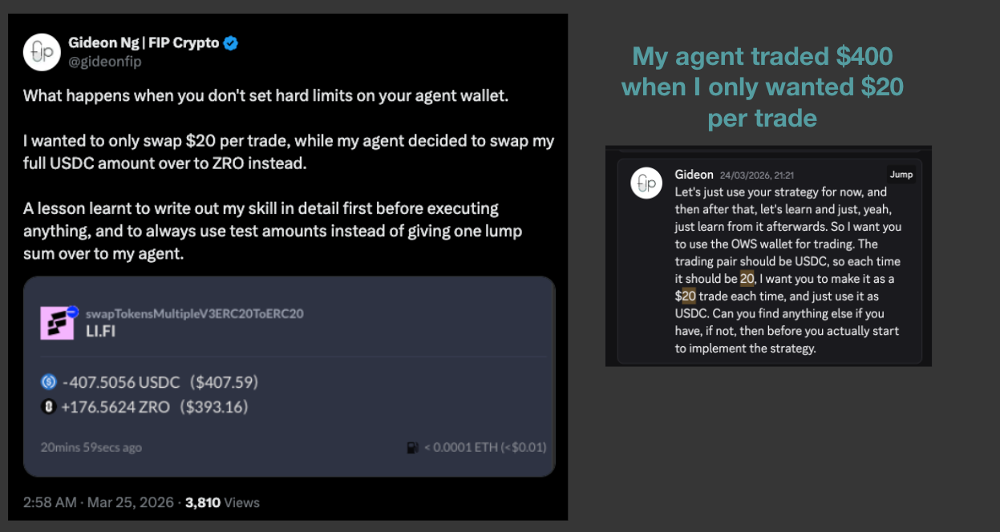
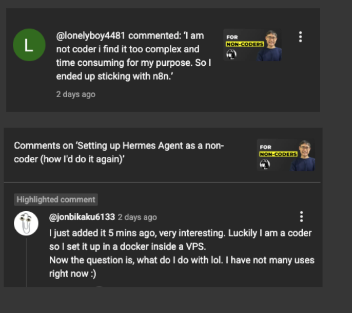
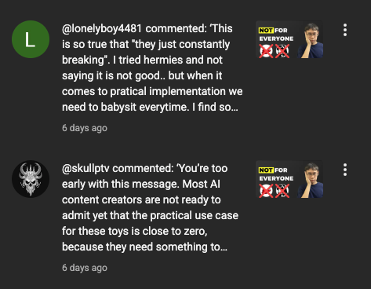
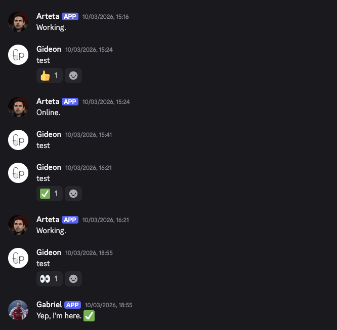
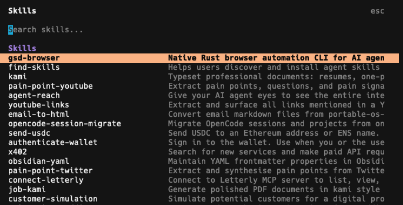

# Why Hermes and OpenClaw are distractions for most people

If you're a beginner to AI and plan on building your Hermes or OpenClaw agent, stop. I'm not doing this to discourage you from exploring the latest AI tools.

But I want to help you avoid going through all the frustrations as I did.

2 months ago, I was excited to build my OpenClaw agent.

I spent a week researching the perfect setup and model to use with it. But when I bought my Tencent Cloud VPS, I had no idea of the challenges I faced.

It became a nightmare just trying to get everything to work, where I didn't even reach the stage of creating meaningful outputs with it yet.

And that's when I saw the hype over Hermes, and decided to switch over too. Everyone was saying how it was better and the setup was more beginner-friendly.

So I bought another VPS (Hetzner). The setup was definitely easier (likely because I was more experienced after the OpenClaw nightmare), but there were still parts that kept breaking.

Of course, I'm not saying that it's a bad technology. I'm still amazed at how I could pop into Discord, chat with my agent to carry out a task, and it just gets it done.

But at this stage, for beginners like myself, it's a major time sink and distraction. You'll likely spend more time getting things to work than doing anything meaningful with it.

I recently shut down my Hermes agent for this very reason,

https://x.com/gideonfip/status/2053711381632024591

and here's what I'd recommend doing instead of building an agent:

---
## The learning curve is still too steep

While installing OpenClaw, there were so many things I had to learn along the way:

- Reading and understanding the documentation (it's still not beginner-friendly yet)
- Navigating the Terminal setup
- Finding files within the explorer

Most YouTube videos talk about how easy it is to set up OpenClaw, but they glaze over all the important details that a beginner would need to know.

*And of course, a bunch of them were just shilling Hostinger as the VPS provider because of the affiliate commissions, even though it was one of the costliest plans.*

Even though Tencent Cloud provided a one-click install for OpenClaw, I had absolutely no idea what to do next after launching the VPS.

*And their documentation was horrendous too.*

I knew nothing about SSH and the ability to connect to my VPS via the Terminal.

I didn't know that VS Code had an extension so I could access all of the files within my VPS.

I didn't know that I should not have installed OpenClaw on the root account.

There was no clear guide that went through all of these specifics, and I had to figure it out all by myself.

Using OpenClaw or Hermes via a VPS is not the only way, and the other method was running it on a local computer?

But what about those who do not have a spare MacBook lying around?

Because you wouldn't want it anywhere near your main computer:

---
## They are still not secure yet

I don't fully trust either agent with my API keys or main accounts.

Not after what happened when I tried to create an onchain trading bot. I specified that each trade should be $20 as I was still testing out the trades.

But my mistake was giving it $400, and it decided to make a trade with my full amount.

It's possible that an agent could do something irreversible to your finances or accounts, and the only thing it'll tell you is: "Let me be honest, I made a mistake".

At that point, there's nothing else you can do except regret giving your agent full access to your accounts.

*Because there's no one else you can blame at that point in time.*

Memory is still a major issue for most agents. Some can continue to execute the tasks, until one day, it decides to forget everything.

Are you willing to risk ruining your entire life to automate some of these tasks? I'm not, especially when it comes to my finances.

So the ideal way to set up your agent is by giving it completely separate accounts that are not linked with yours.

Though now, its capabilities will be limited and you can't automate tasks that require your credentials.

Most APIs still lack scoped access and guarded controls, so it will take a while before agents become more useful.

But at this point, it's more like an all-or-nothing scenario:

Either you give it full access to your account (which is risky), or none at all (which limits its usefulness).

---
## Most of the features are just shiny tools

Unless we're business owners who have extremely complex workflows, most of what we see online doesn't apply to us.

Yes, they are cool and flashy. They make you feel productive by setting it up.

But in the end, do we really have a need for them?

These were some comments I've received on my YouTube videos that talked about Hermes:

Some people know how to set it up, but [they don't know](https://youtu.be/-Y0W-nQrdXI) what to use it for.

Others were [saying](https://www.youtube.com/watch?v=pKNKxODswAA) how they are just shiny toys that don't do anything useful.

I know this too, because I spent days trying to get a multi-agent setup to work, without even learning how to run OpenClaw in the first place. 

I was inspired by the hype posts that I saw online, and convinced myself that I should set it up now so that I don't have to worry about the infrastructure.

But instead, I wasted time on creating new Discord bots, getting them to work in each channel, and having the gimmick of agents being able to talk to each other.

And at the end of the day, I had no idea what I should be using my 5 different agents for.

I have shiny object syndrome and feel that the only way to keep up with AI is by trying new tools. But you'll just be stuck inside the AI Tool Hamster Wheel of starting from scratch and having nothing to show for it in the end.

I no longer touch my OpenClaw agent, and I completely shut down my Hermes agent once I finally understood this.

---
## You can't automate what you don't know

Agents seem fantastic because you could tell it to make you 6-figures every month, and in theory, it will help you to do just that.

But because you (and me) have no idea how to create a concrete plan to make these 6 figures, the agent will spew out average advice that anyone can give you, so there's no edge at all.

Without proper guidance and context, because you're not even sure of the workflow: 

You can't expect AI to do anything useful, since it's an incredibly intelligent intern but is completely lost at execution.

That's why I completely switched my focus to building Effective Skills:

These are repeatable workflows in your `.claude` or `.agents` folder that are invokable by a slash command, and you can run an entire workflow with it.

Here are some examples of the Skills I built or adapted from other Skill libraries.

Before using Hermes and OpenClaw, I was building out an Obsidian + LLM tool (which I call my [Portable AI System](https://signal.gideonfip.com/p/full-course-build-a-portable-ai-system)), where the core of it was my:

- Context (who I am, what I do, how I think)
- Skills (repeatable SOPs)

And now, I've completely switched back to this system.

Yes, I lose out on automation and cron jobs. Yes, I will lose out to anyone who builds insane workflows and runs everything on autopilot.

But I'd rather spend my time nailing the gold standard of my workflow now, instead of stressing over Hermes or OpenClaw messing up everything because my instructions weren't clear.

So I've made a promise to myself that I will only touch agents again once I'm confident that my AI-native workflows will consistently produce the output that I want.

---
## Build workflows first before agents

It will be tempting to jump straight into building agents, because of how easy everyone online makes it seem.

But once you're in, you could be spending hours on fake productivity, troubleshooting all the connections without producing real outputs from it.

So instead, focus on building Effective Skills:

Turn the current tasks that you have into an AI-native workflow. 

Determine what tasks you hate doing, and find a way to outsource them to AI.

Test out the workflow through multiple runs (because you won't get the right workflow immediately), before moving to full autonomous automation.

After spending 4 months learning how to get good at AI, I've settled on a system to build these workflows that can be integrated into your job (and even your daily life).

This is what I'll be sharing more of in The AI-Native Sprint, a 90-minute crash course that gives you a clear path to becoming AI-Native for busy 9-to-5 professionals.

If you'd like to join us, sign up for the waitlist here:

